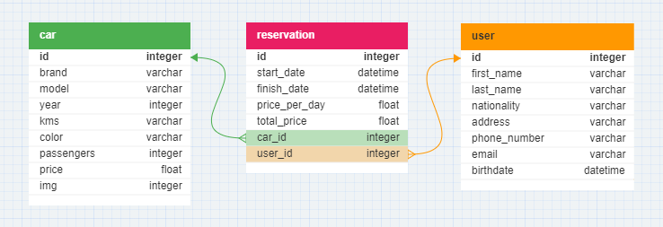

<h1 align='center'>Rent a car back-end</h1>

<h2 align='center'>Diagrama de entidad relación</h2>

<p align='center'>
  
</p>

### Especificaciones
- Servidor: http://127.0.0.1:8080
- Versión: 1.0.0
- Autor: Javier Anibal Villca
- Repositorio GitHub: git+https://github.com/Javier104-dev/rent-a-car-backend.git

### Tecnologías utilizadas
- **MySQL**: Sistema de administración de bases de datos relacionales.
- **Sequelize v6.32.1**: ORM (Object-Relational Mapping), facilita la comunicación entre una aplicación Node.js y la base de datos relacional.
- **mysql2 v3.5.2**: Controlador que utiliza Sequelize para poder comunicarse de forma eficiente a MySQL.
- **rsdi v2.3.0**: Biblioteca para inyección de dependencias.
- **Node.js v18.16.0**: Plataforma de ejecución de JavaScript del lado del servidor.
- **Express**: Framework web para Node.js, simplifica la creación de aplicaciones web y APIs.
- **ESLint**: Herramienta de linting para mantener un código JavaScript/Node.js consistente y legible.
- **Dotenv**: Carga variables de entorno desde un archivo `.env` en la aplicación.
- **Nodemon v3.0.1**: Reinicia el servidor automáticamente cuando detecta un cambio.

### Sobre el proyecto
Creación de un servidor para la gestión de un negocio de renta de autos. El servidor cumple con las reglas de una `API RESTful`, se permiten operaciones CRUD y las rutas de acceso a los endpoint son reutilizables.

El proyecto está construido con clases y con una arquitectura en capas para lograr el encapsulamiento y abstracción de todo el código, siguiendo los principios `SOLID` para el desarrollo de aplicaciones, sobre todo `Dependency Inversion: Inversión de dependencia`, usando la biblioteca [rsdi](https://www.npmjs.com/package/rsdi) para lograr la inyección de dependencias.

### MySQL y consultas
En este proyecto usamos MySQL como base de datos, porque necesitamos relacionar varias tablas para lograr el objetivo del proyecto y poder gestionar las reservas correctamente. Las tablas User y Car usan como tabla intermedia a Reservation.

`Sequelize` nos facilita la comunicación con MySQL, también nos ayuda con la creación y la sincronización de las modelos, corriendo el comando `npm run database:sync`.

Para la obtención de datos relacionados, o sea traer un registro junto con todos sus registros asociados de otras tablas, se utiliza `include`(operación `JOIN` en SQL) de Sequelize, asi podremos relacionar las tablas y obtener, por ejemplo, una reservación con el auto y usuario correspondiente.

Ejemplo:
- **Request**
  - Método: Get.
  - URI: http://127.0.0.1:8080/reservation/1

- **Response**
  ``` json
  {
    "id": 1,
    "startDate": "2023-11-25T02:05:00.000Z",
    "finishDate": "2023-11-30T02:05:00.000Z",
    "pricePerDay": 1000,
    "totalPrice": 5000,
    "carId": 1,
    "userId": 1,
    "createdAt": "2023-11-25T02:05:18.000Z",
    "updatedAt": "2023-11-25T02:05:18.000Z",
    "Car": {
      "id": 1,
      "brand": "Renault",
      "model": "Daster",
      "year": 2021,
      "kms": 6000,
      "color": "black",
      "passengers": 5,
      "price": 1000,
      "img": null,
      "createdAt": "2023-11-25T01:46:09.000Z",
      "updatedAt": "2023-11-25T01:46:09.000Z"
    },
    "User": {
      "id": 1,
      "firstName": "Juan",
      "lastName": "Perez",
      "nationality": "Argentina",
      "address": "Calle 234",
      "phoneNumber": "42425858",
      "email": "juan@gmail.com",
      "birthdate": "1980-01-01T00:00:00.000Z",
      "createdAt": "2023-11-25T01:53:41.000Z",
      "updatedAt": "2023-11-25T01:53:41.000Z"
    }
  }
  ```

### Modulos
Cuenta con tres módulos principales, que a mi parecer son el corazón de la aplicación porque se encargan de la lógica de negocios y comunicación con la base de datos MySQL.

- car
- reservation
- user

Cada uno de ellos contiene la lógica para la creación de sus respectivas `entidades` que son utilizadas en todos los niveles y módulos del proyecto, también se encargan de la creación de los `modelos` de tablas que son necesarios para acceder a las funciones que nos brinda Sequelize y poder convertir nuestras funciones a lenguaje SQL e interactuar con la base de datos de una forma más segura.

### Sincronizacion con MySQL
Antes de iniciar el proyecto debemos sincronizar los modelos con la base de datos, para eso se utiliza la función asincrónica `.sync()` que nos brinda Sequelize. Con ella podemos crear las tablas en la base de datos si no existe o actualizarlas si hacemos algún cambio en los modelos. Por `seguridad` solamente se utiliza para la creación de las tablas.

<h2 align='center'>Estructura de este proyecto</h2>

*En la carpeta module se encuentran los módulos car, user y reservation, todos tienen la misma estructura de carpetas y lógica, por lo que solo se explicara el funcionamiento en forma general.

| Ruta                    | Explicación                                                                  |
| :---------------------- | :--------------------------------------------------------------------------- |
| src                     | Contiene toda nuestra aplicación                                             |
| src/cli                 | Se encarga de la sincronizacion de los modelos con la base de datos MyQSL    |
| src/config              | Configuración de nuestra aplicación                                          |
| src/config/config.js    | Distribuye las variables de entorno a toda nuestra aplicación                |
| src/config/configDb.js  | Configura Sequelize para su uso                                              |
| src/config/configDi.js  | Configuración de dependencias (Dependency Injection)                         |
| src/module              | Contiene cada uno de los módulos de nuestra aplicación                       |
| src/module/*/controller | Capa encargada de gestionar las solicitudes HTTP del proyecto                |
| src/module/*/services   | Lógica de negocio de nuestra aplicación                                      |
| src/module/*/repository | Interactúa con la capa de acceso a datos (DAL) y devuelve entidad(es)        |
| src/module/*/model      | Modelo de tabla que se utiliza para las consultas y sincronización con MySQL |
| src/module/*/routes     | Gestiona las rutas de acceso para cada endpoint del módulo                   |
| src/module/*/entity     | La entidad que se utilizara en este módulo                                   |
| src/module/*/mapper     | Mapea desde o hacia la entidad requerida                                     |
| src/module/*/module.js  | Punto de entrada al módulo                                                   |
| src/app.js              | Punto de entrada de nuestra aplicación                                       |

<h2 align='center'>Métodos HTTP</h2>

### Métodos utilizados en el proyecto
(*) Módulo car, reservation o user.

| Tipo   | URI                           | Descripción                                                                   |
| ------ | ----------------------------- | ----------------------------------------------------------------------------- |
| GET    | http://127.0.0.1:8080/(*)     | Obtiene todos los registros de la DB                                          |
| GET    | http://127.0.0.1:8080/(*)/:id | Obtiene un registro en específico                                             |
| POST   | http://127.0.0.1:8080/(*)     | Crea o actuliza un registro                                                   |
| DELETE | http://127.0.0.1:8080/car/:id | Únicamente el módulo car tiene el metodo delete. Elimina un registro de la DB |
| USE    | *                             | Página no encontrada                                                          |

<h2 align='center'>Ejemplos de peticiones y métodos</h2>
En cada ejemplo se usará un módulo diferente, ya que todos tienen una estructura y métodos similares, salvo Car que es el único en tener un método DELETE.

### Método GET
**Request**
- Ejemplo de URI utilizado
  ```
  http://127.0.0.1:8080/user
  ```

**Response**
- Código **HTTP 200** *Ok*
  ``` json
  [
    {
      "id": 1,
      "firstName": "Juan",
      "lastName": "Perez",
      "nationality": "Argentina",
      "address": "Calle 234",
      "phoneNumber": "42425858",
      "email": "juan@gmail.com",
      "birthdate": "1980-01-01T00:00:00.000Z",
      "createdAt": "2023-11-25T01:53:41.000Z",
      "updatedAt": "2023-11-25T01:53:41.000Z"
    },
  ]
  ```
- Código **HTTP 500**: *Error interno*

### Método GET - Específico
**Request**

- Ejemplo de URI utilizado
  ```
  http://127.0.0.1:8080/car/4
  ```

- Parámetro obligatorio de tipo URL
  - **4**: *(tipo: integer. Indica el código del auto que se quiere obtener)*

**Response**
- Código **HTTP 200** *Ok*
  ``` json
  {
    "id": 4,
    "brand": "Ford",
    "model": "Ranger",
    "year": 2023,
    "kms": 8000,
    "color": "black",
    "passengers": 5,
    "price": 2000,
    "img": null,
    "createdAt": "2023-11-25T01:49:26.000Z",
    "updatedAt": "2023-11-25T01:49:26.000Z"
  }
  ```
- Código **HTTP 500**: *El id no esta definido*
- Código **HTTP 500**: *No se encontraron autos con el id 4*

### Método POST
**Request**
- URI utilizado
  ```
  http://127.0.0.1:8080/reservation
  ```

- Parámetros requeridos del BODY
  - **"startDate"="2023-11-25T02:05:00.000Z"**: *(tipo: date. Fecha de inicio del alquiler)*
  - **"finishDate"="2023-11-30T02:05:00.000Z"**: *(tipo: date. Fecha final del alquiler)*
  - **"carId"="1"**: *(tipo: integer. Id del auto alquilado)*
  - **"userId"="1"**: *(tipo: integer. Id del cliente registrado)*

**Response**
  - Código **HTTP 200** Ok
    ``` json
    {
      "id": 1,
      "startDate": "2023-11-25T02:05:00.000Z",
      "finishDate": "2023-11-30T02:05:00.000Z",
      "pricePerDay": 1000,
      "totalPrice": 5000,
      "carId": 1,
      "userId": 1,
      "createdAt": "2023-11-25T02:05:18.000Z",
      "updatedAt": "2023-11-25T02:05:18.000Z",
    }
    ```
  - Código **HTTP 500**: *El id no esta definido*
  - Código **HTTP 500**: *No se encontraron usuarios con el id 1*
  - Código **HTTP 500**: *No se encontraron autos con el id 1*
  - Código **HTTP 500**: *El Auto debe ser una instancia de Car*
  - Código **HTTP 500**: *El Usuario debe ser una instancia de User*

### Método PUT usando POST
Usamos el método POST y su URI para actualizar un registro, con la `lógica de Sequelize` podremos identificar y saber que hacer con los datos recibidos, dependiendo de si posee o no ID.

Si `posee un ID`, Sequelize usara la entidad para modificar un registro existente con ese ID.
<br>
Si `no posee un ID`, Sequelize entenderá que esa entidad no existe y creara su registro.

**Request**
- URI utilizado
  ```
  http://127.0.0.1:8080/car
  ```

- Parámetro obligatorio del BODY
  - **"id"=4**: *(tipo: integer. Indica el id del auto que se requiere modificar)*

- Parámetros requeridos del BODY
  - **"color"="yellow"**: *(tipo: string. Establece el valor del nombre)*
  - **"passengers"=4**: *(tipo: integer. Establece el valor del número de ocupantes del auto)*
  - **"price"=1500**: *(tipo: float. Establece el precio por dia del auto)*

**Response**
  - Código **HTTP 200** Ok: *Registro con id: 1 actualizado con exito*
    ``` json
    {
      "id": 4,
      "brand": "Ford",
      "model": "Ranger",
      "year": 2023,
      "kms": 8000,
      "color": "yellow",
      "passengers": 5,
      "price": 2000,
      "img": null,
      "createdAt": "2023-11-25T01:49:26.000Z",
      "updatedAt": "2023-11-28T05:49:26.000Z"
    }
    ```
  - Código **HTTP 500**: *El auto debe ser una instancia de Car*;

### Método DELETE
Solo disponible en el módulo Car.

**Request**
- URI utilizado
  ```
  http://127.0.0.1:8080/car/5
  ```

- Parámetro obligatorio de tipo URL
  - **5**: *(tipo: integer. Indica el id del auto que se requiere eliminar)*

**Response**
- Código **HTTP 200** Ok: *Auto con id 5 eliminado*
- Código **HTTP 500**: *El id no esta definido*
- Código **HTTP 500**: *El auto debe ser una instancia de Car*

<h2 align='center'>Instrucciones de instalación</h2>

### Requerimientos
- IDE - Visual Studio Code v1.84.2
- MySQL v8.0
- Git v2.43.0
- Node.js v20.9.0

### Preparando el ambiente
- Descargar o clonar el repositorio.
- Instalar las dependencias necesarias con el comando `npm install`.
- En la raíz del proyecto crear un archivo `.env`, copiar las variables de entorno que se encuentran en el archivo `.env.dist` y reemplazar su valor siguiendo las indicaciones.
- Usar el comando `npm run schema:sync` para sincronizar los modelos con la base de datos, esto creará las tablas si no existen o las actualizará si se hace algún cambio.
- Correr el comando `npm start` para iniciar el servidor.
- Correr el comando `npm run dev` si se desea modificar el código, este comando usa Nodemon para reiniciar el servidor cada vez que se detecta un cambio.
- Usar la URL base `http://127.0.0.1:8080` para interactuar con el servidor.

---

### Autor
| [<br><sub>Javier Anibal Villca</sub>](https://github.com/Javier104-dev) |
| :------------------------------------------------------------------------------------------------------------------------------------------------: |

